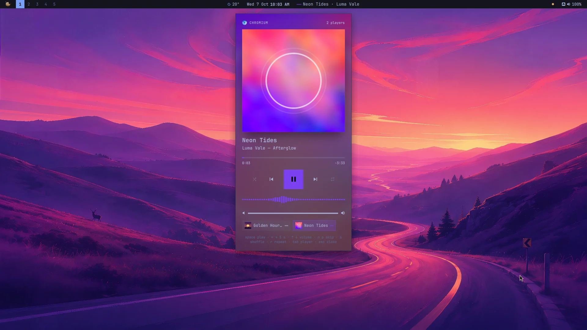
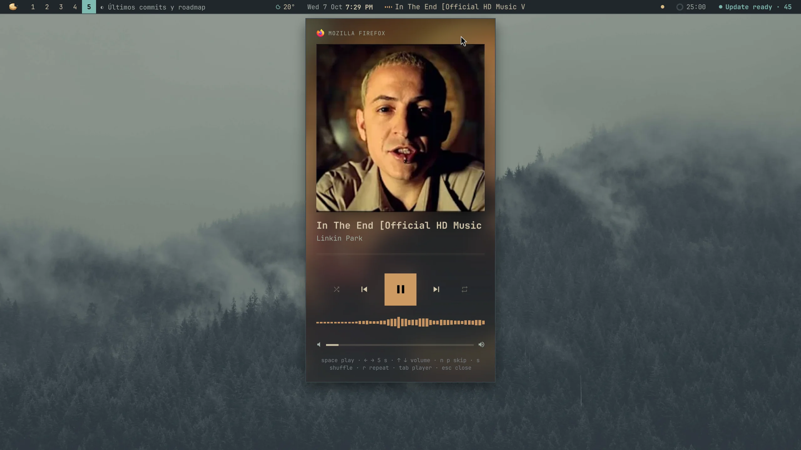
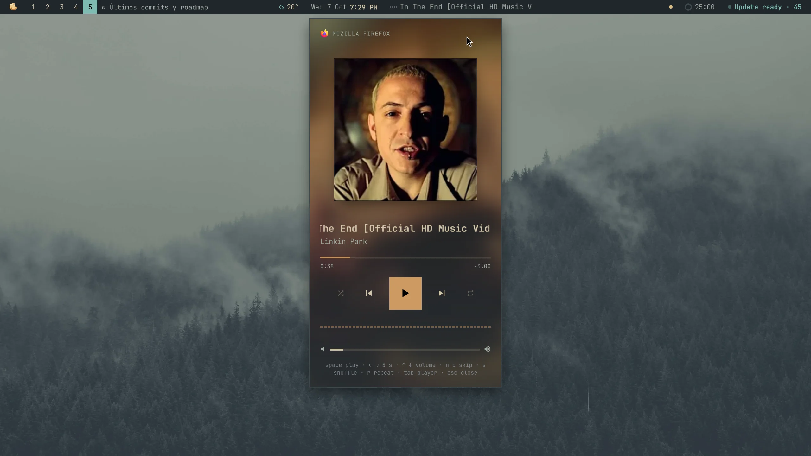
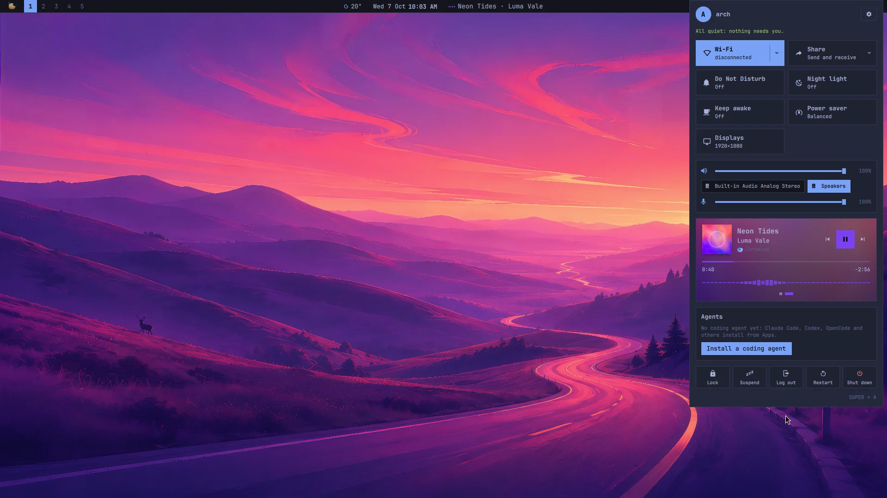
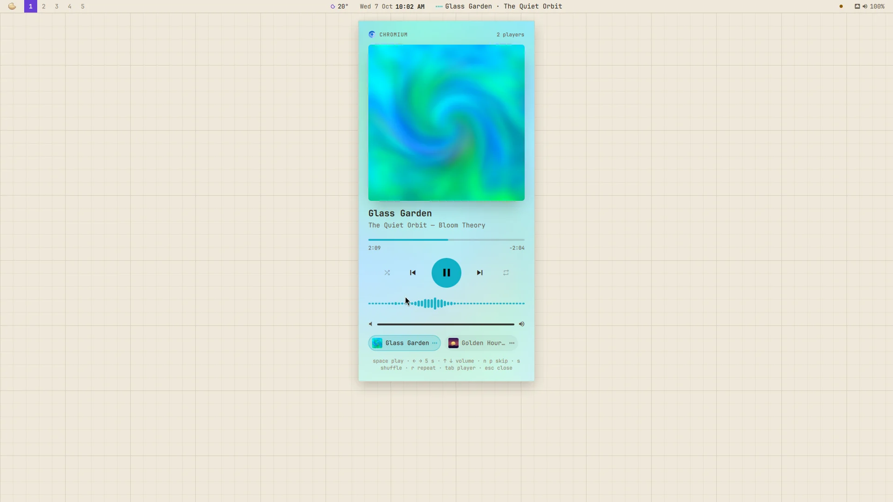

# Now Playing

A plugin for [Mazapan](https://mazapan.dev), listed in its [plugin registry](https://mazapan.dev/plugins/now-playing/).



What's playing, wherever it plays: Spotify, YouTube in a browser, mpv, any
app that says what it plays (MPRIS). One look shows the song; one key, the
whole player.

- **The panel** drops from the bar over the cover, blown up and blurred
  into light. The cover floats while it plays and settles back when you
  pause; a new song fades in over the old one, its title lifting into
  place.
- **The cover's colors**: the bar that moves through the song, the play
  button and the sound take the cover's color, readable on any theme, dark
  or light.
- **A bar to drag through the song**, growing under the pointer, with the
  time gone and the time left. Shuffle, back, play, next and repeat, as
  far as the player allows them; back goes to the start of the song first.
- **The sound drawn as it plays** (cava, listening to what goes out), only
  while the panel or the Control Center is open.
- **Every player at once**: one starts playing and takes over, as on a
  phone; or pick one by hand from its chip (its song and cover).
- **Its volume**, for players that have their own.
- **In the bar**, beside the clock: the song and the artist with little
  bars that dance while it plays. A click opens the panel, a right click
  plays or pauses, a middle click skips, the wheel changes its volume.
- **In the Control Center**, in place of its music: the cover, the
  buttons, the bar with its times, the sound and a dot for each player.







`SUPER + ALT + N` opens it; in the palette, "Now Playing" plays, pauses
and skips. In the panel: space plays or pauses, ← → move 5 seconds, ↑ ↓
the volume, N and P skip, S shuffles, R repeats, Tab goes to the next
player, Esc (or a click outside) closes.



## What it reaches and why

- **The players, over D-Bus (MPRIS)**: what they play, and the buttons you
  press. Nothing else of theirs.
- **cava** (installed with it): listens to what goes out of the speakers to
  draw the bars, while the panel or the Control Center is open and
  something plays. Nothing is recorded or sent anywhere.
- **The cover**, as the player gives it (a file or an address it already
  fetched), to show it and take its colors.
- **Files it writes**: its part of the shell (`components/now-playing/`, the
  bar's widget, the Control Center's section, the panel), its key in
  Hyprland, and its settings, read as they change (no reload).

The Control Center's own music steps aside for it from Mazapan 0.4.2 on: a
Control Center part with the same name and a higher number takes the
other's place. With this plugin off, the original is back.

## Install

In Mazapan, the Plugins panel (`SUPER + SHIFT + P`) lists it under the
community's: its page shows what it can do before you install it. Or:

```sh
mazapan plugins add now-playing
mazapan apply
```

Updates come through the registry: `mazapan plugins update now-playing`, or
the Updates panel, asking again only for anything new it would be able to
do.

## Develop

```sh
git clone https://github.com/rick-dev-creator/mazapan-now-playing
mazapan plugins dev mazapan-now-playing     # applied again on every save
mazapan plugins check mazapan-now-playing   # every theme, every language, before a release
```

A release is a tag, `vX.Y.Z`, the same as `version` in plugin.toml; the
registry lists it once it passes its checks.

## License

MIT
